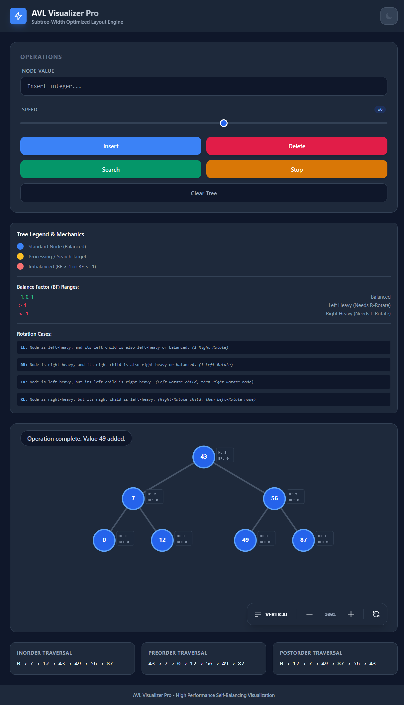

# AVL Tree Visualizer

An interactive web-based AVL Tree Visualizer that demonstrates
self-balancing binary search tree operations in real time.

The tool helps students understand AVL tree rotations and
balance factor updates through smooth animations.

---

## ✨ Features

- Insert nodes into AVL Tree
- Delete nodes
- Automatic balance factor updates
- Visualize rotations:
  - LL Rotation
  - RR Rotation
  - LR Rotation
  - RL Rotation
- Smooth animations for better learning

---

## 🛠 Tech Stack

- React
- TypeScript
- Tailwind CSS
- Vite

---

## 📷 Demo

---

## 🚀 Run Locally

Prerequisite: Node.js

Install dependencies

npm install

Run the development server

npm run dev

---

## 🌐 Live Demo

https://avl-tree-visualizer.vercel.app